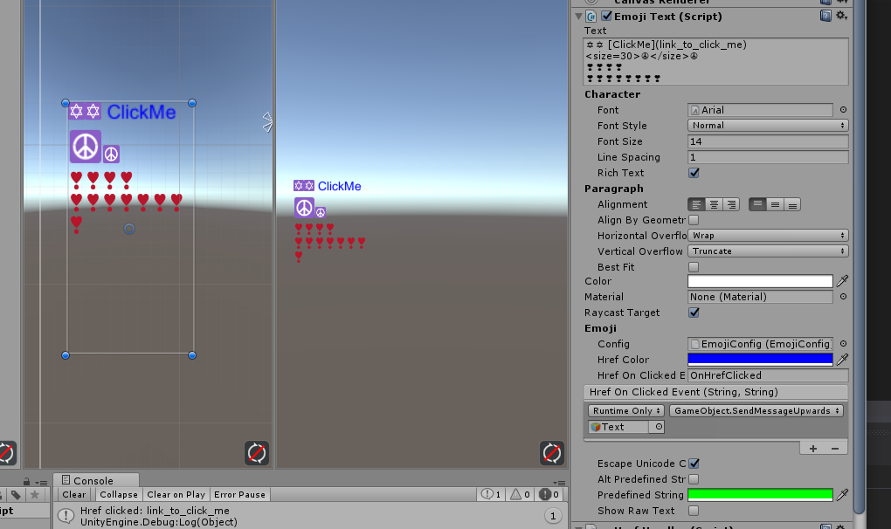

# Untiy3D.EmojiText

## EmojiText

+ Extends from UnityEngine.UI.Text
+ Has the same performance if no EmojiConfig attached.
+ Layout handled by UnityEngine.UI.Text, only replaces UVs of generated text mesh. Thus you can use RichText to change size and color of text. (Emoji sprite wont change color. I disabled it. And you also need to set sizeFactor in EmojiConfig to 1)
+ No sub GameObject needed (actually need one for attaching CanvasRenderer). Use CanvasRenderer to render emoji mesh.
+ Support hyperlink click event with markdown link syntax. `[ClickMe](link_to_some_place)`
+ Support pre-defined text by markdown predefined text syntax. \`predefined text\`. And predefined text replacements delegates to `EmojiText.willInsertBackOnePredefinedString`.
+ Support escape character by input \uxxxxx directly.
+ Generate your own EmojiConfig with different emojis by using AltasBaker in Emoji -> Atlas Baker (you can use altas baker for other stuff, it reports all UVs and names to AtlasBakerWizard.OnAtlasBaked)
+ Works in edit mode.

## License

TwitterEmoji comes from [Twemoji project](https://github.com/twitter/twemoji). It licensed under [CC-BY 4.0](https://creativecommons.org/licenses/by/4.0/). And I copied from [Unity-UI-emoji](https://github.com/mcraiha/Unity-UI-emoji). 

Idea and some part of code come from [Unity-UI-emoji](https://github.com/mcraiha/Unity-UI-emoji), I changed it to fit my implementation.

## Misc

steam: 0x600d1dea

